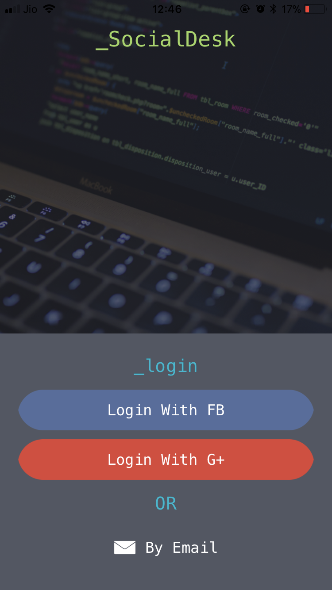
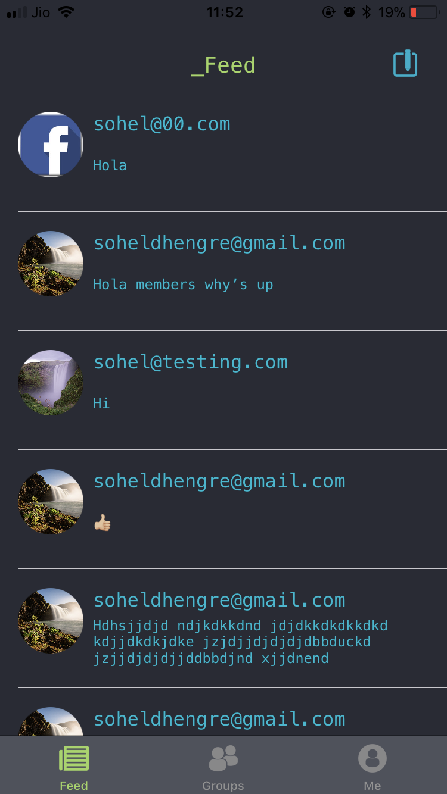
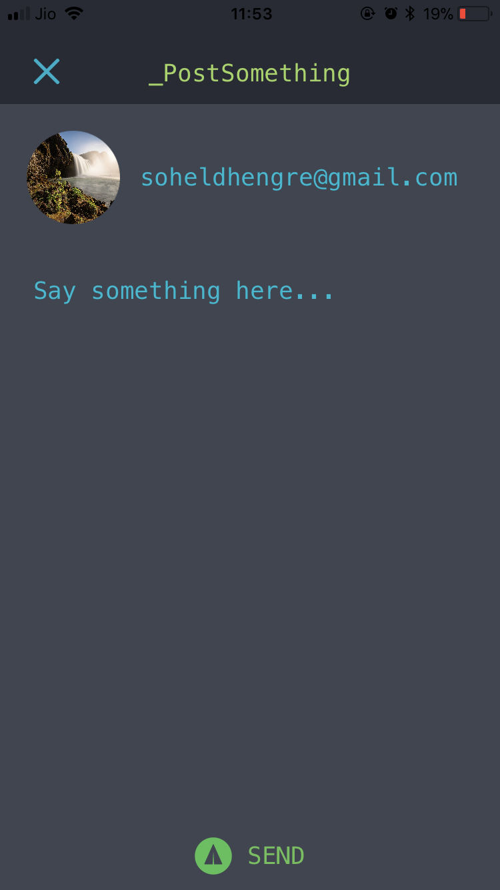
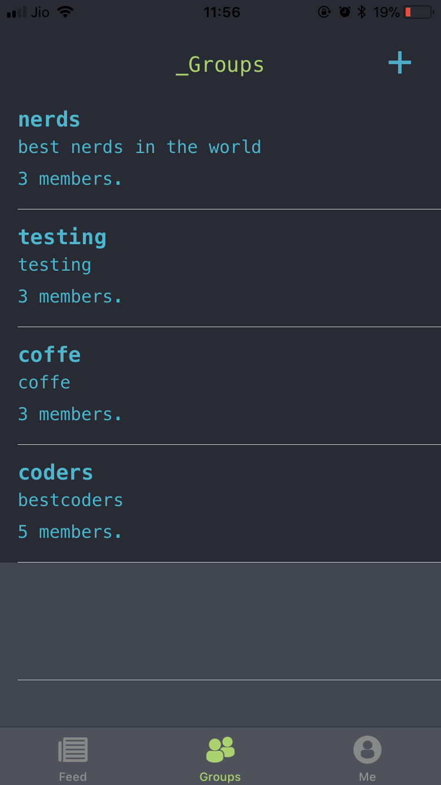
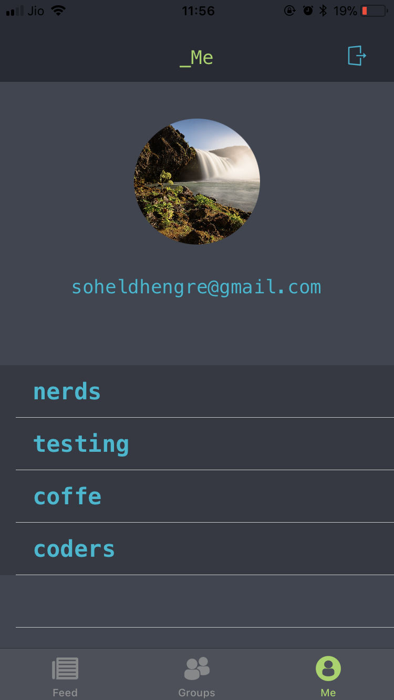

# SocialDesk
<br>
SocialDesk is a chat app where you can post feeds, create groups using emails for private chat and it has a feature of setting profile image.
<br>

### Backend Used:
FireBase
<br>

### Pods Used :
```pod 'Firebase/Core'```<br>
```pod 'Firebase/Database'```<br>
```pod 'Firebase/Auth'```<br>
```pod 'GoogleSignIn'```<br>
```pod 'IQKeyboardManagerSwift'```<br>
```pod 'FBSDKCoreKit'```<br>
```pod 'FBSDKShareKit'```<br>
```pod 'FBSDKLoginKit'```<br>
```pod 'Firebase/Storage'```<br>
```pod 'Kingfisher', '~> 4.0'```
<br>

### Screenshots:
     
